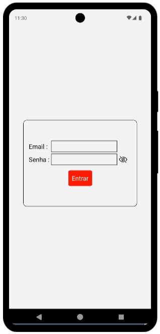

## Infnetfood
Projeto em react-native com finalidade de aprimorar meus conhecimentos e habilidades de desenvolvedor

## Instalação

Instruções de Instalação:

- Clone o repositório
```bash
git clone https://github.com/AugustoCedro/InfnetFood
```
- Instale as dependências:
 ```bash
    npm install
```
- Inicie a aplicação:
 ```bash
    npm start
```

## Utilização/Exemplos

### Tela de Login

